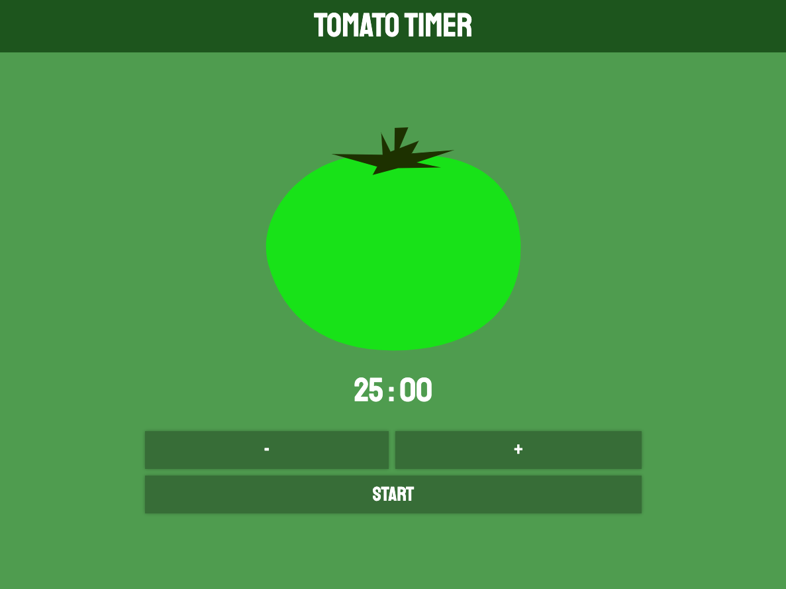

# TomatoTimer

A simple web tool helps improving productivity by tracking time.

## Demo

Link: https://chichiy.github.io/TomatoTimer/

## Technologies

- Front-End Fundamental
  - HTML / CSS / JavaScript
  - RWD

## Features

### Time Tracker

Counting down for given time.

### Notification of Remaining Time

Showing remaining time on website title for better user experience.

## Future Features

- Allow Input time.
- Add To-do list below time tracker.
- Record total focus time on the side.

## Contact

E-mail: <jjliao8889@gmail.com>
